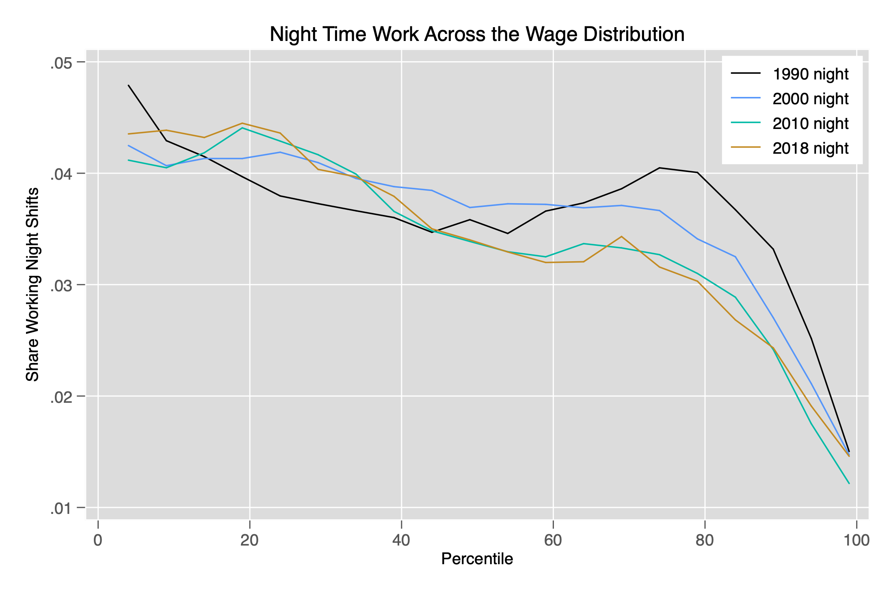

# night-shift-work-IPUMS-census
Estimate location of night shift workers in the US wage distribution (1990-2018)

This analysis presents the probability of working night shifts throughout the yearly wage distribution in the US. The data comes from the IPUMS files of the US decennial Census surveys in 1990, 2000, and 2010 and the American Community Survey 2018. Overall, low-wage workers are about three times more likely to be working nights than high-wage workers.

The figure below summarizes the findings:

Data source: IPUMS USA, University of Minnesota, www.ipums.org.
